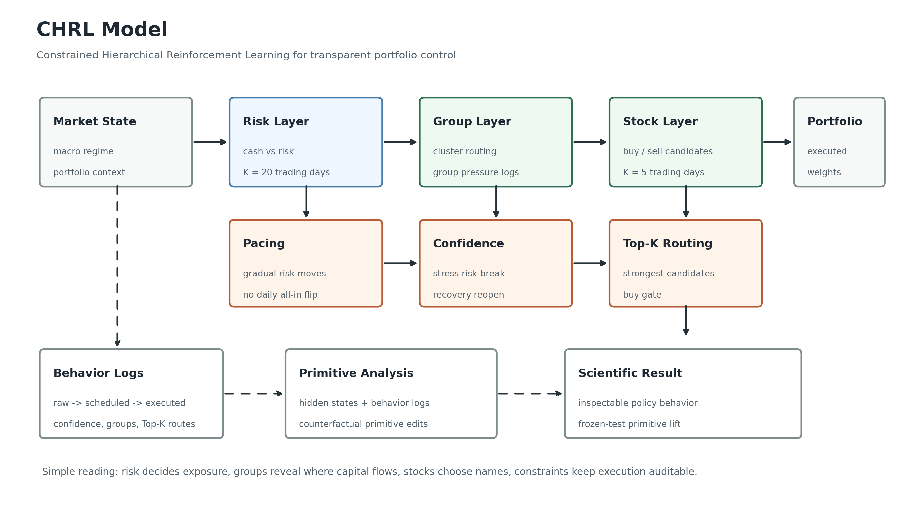
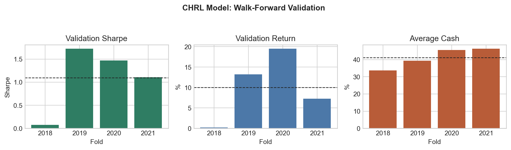
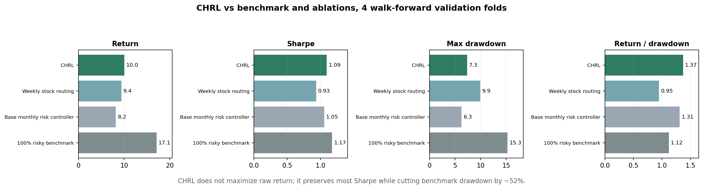
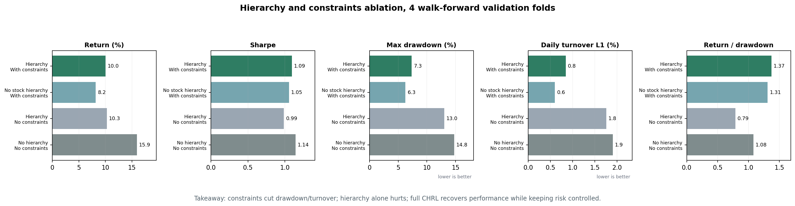
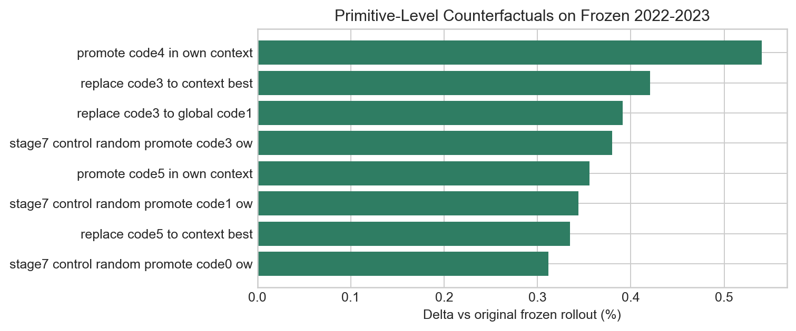

# CHRL Model

**Constrained Hierarchical Reinforcement Learning for interpretable portfolio control.**

This project continues the research line started in
[RL-based-Feature-Ablation](https://github.com/Sqaard/RL-based-Feature-Ablation)
and feeds into the broader interpretability work in
[Interpretable-CHRL](https://github.com/Sqaard/Interpretable-CHRL).

## Abstract

The CHRL model is a portfolio RL agent designed around **transparent behavior**, not just a single end-to-end action vector.
Its main idea is to make the trading decision visible through three layers:

| Layer | Role | Update Rhythm | What We Can Inspect |
| --- | --- | --- | --- |
| **Risk Layer** | Chooses cash vs risky exposure | **20 trading days** / about 1 month | when the model de-risks, re-risks, or stays defensive |
| **Group Layer** | Routes capital through stock clusters | inherited from stock/risk context | which economic or residual groups receive pressure |
| **Stock Layer** | Selects buy/sell candidates | **5 trading days** / about 1 week | which names receive capital, which names are reduced |

The **constrained** part is implemented as simple, interpretable guardrails:

- **Exposure pacing:** the risk layer cannot instantly flip the whole portfolio every day.
- **Confidence-scaled trading:** weak signals trade less; strong risk/recovery signals trade more.
- **Event triggers:** stress can force earlier de-risking, recovery can reopen risk.
- **Top-K routing:** capital is routed only through the strongest buy/sell candidates.
- **Buy gate:** new risky exposure is blocked unless recovery evidence is visible.

## Why This Model Exists

The earlier feature-ablation project showed that adding more features or learned market states is not automatically useful.
The useful direction was simpler: keep macro context clean, separate cash/risk control from stock selection, and make the controller behavior auditable.

| Research Question | Finding | CHRL Design Choice |
| --- | --- | --- |
| Is the problem mainly feature quantity? | No. Compact macro context was more robust than broad feature expansion. | Keep the risk layer focused on market context. |
| Is cash just another asset? | No. Treating cash as a normal stock-like weight can create hidden cash-heavy behavior. | Use an explicit risk/cash layer. |
| Can a policy be interpretable after training? | Yes, if the execution path is logged as layered decisions. | Log raw target, scheduled target, executed weights, confidence, groups, and Top-K routes. |

## CHRL in 3 Steps

1. **Feature Science**  
   A previous walk-forward ablation found that macro context was more robust than broad or learned feature stacks.

2. **Risk/Routing Split**  
   The portfolio action was split into an explicit cash/risk decision and a stock-allocation decision.

3. **Constrained Hierarchy**  
   Monthly risk pacing, weekly stock routing, confidence gates, event triggers, group-aware routing, and Top-K selection were added to make behavior stable and readable.

## Main Validation Snapshot

The current favorite CHRL candidate was trained/evaluated in walk-forward validation over four folds.

The important comparison is not just the standalone Sharpe. CHRL is a constrained portfolio controller, so the right question is:

> How much risky-market performance can it keep while reducing downside?

| Metric | Mean Across Folds |
| --- | ---: |
| Validation return | **10.05%** |
| Annualized Sharpe | **1.09** |
| Max drawdown | **-7.34%** |
| Mean cash weight | **41.24%** |
| Mean daily turnover L1 | **0.84%** |

Against the 100% risky equal-universe benchmark on the same validation windows:

| Comparison | CHRL | Benchmark |
| --- | ---: | ---: |
| Return | **10.05%** | 17.09% |
| Sharpe | **1.09** | 1.17 |
| Max drawdown | **-7.34%** | -15.27% |
| Return / drawdown | **1.37** | 1.12 |

In plain terms: CHRL captured about **93% of benchmark Sharpe** while cutting benchmark drawdown by about **52%**.
It is a risk-managed policy, not a pure all-risk bull-market benchmark chaser.

Fold-level numbers are in [docs/chrl_validation_metrics.csv](docs/chrl_validation_metrics.csv).
Benchmark comparison is in [docs/chrl_benchmark_comparison.csv](docs/chrl_benchmark_comparison.csv).

## Hierarchy vs Constraints Ablation

To separate the effect of hierarchy from the effect of execution constraints, I compared four walk-forward model families:

| Model Family | Hierarchy | Constraints | What It Tests |
| --- | --- | --- | --- |
| Flat baseline | no | no | one flat daily allocation policy |
| Static hierarchy | yes | no | hierarchy alone, without confidence gates |
| Constrained controller | partial | yes | risk pacing and confidence controls before full stock hierarchy |
| Full CHRL | yes | yes | risk/group/stock hierarchy plus constrained execution |

The result is useful because it is not a simple "add hierarchy and win" story.
Hierarchy alone reduced raw performance.
Constraints alone sharply reduced drawdown and turnover.
Full CHRL recovered part of the lost return while keeping risk controlled, reaching the best **return / drawdown** ratio in this comparison.

## Primitive-Level Scientific Result

After training, the model was analyzed with self-supervised primitive discovery.
The useful result is not that every primitive is profitable. The useful result is that **some primitive edits improve a frozen 2022-2023 rollout without retraining the PPO model**.

Best frozen-test counterfactual:

| Counterfactual | Delta Return vs Original | Delta Sharpe vs Original |
| --- | ---: | ---: |
| Promote a context-specific primitive | **+0.54%** | **+0.049** |
| Replace a weak primitive with the context-best primitive | **+0.42%** | **+0.039** |
| Replace a weak primitive with the global-best primitive | **+0.39%** | **+0.037** |

Control-adjusted checks are in [docs/stage7_control_adjusted_top.csv](docs/stage7_control_adjusted_top.csv).

## What Is Committed Here

This repository is intentionally small. It stores only the artifacts needed to communicate the CHRL model:

- `README.md`
- architecture diagram
- compact validation metrics
- compact Stage 7 primitive counterfactual summaries

It does **not** include the full training artifacts, daily logs, cloud packages, or historical experiment branches.

## Status

CHRL is the current favorite research model because it combines:

- competitive validation behavior,
- explicit cash/risk control,
- group-aware stock routing,
- constrained execution,
- and primitive-level interpretability after training.

The next research step is to turn the primitive-level signal into a cleaner training-time objective or policy-improvement loop.
